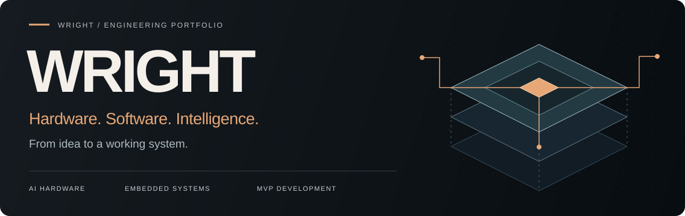
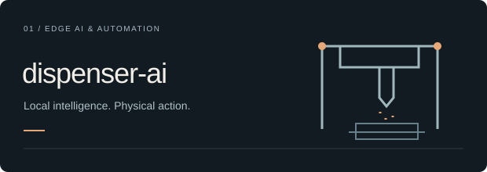

  

  <b>AI 硬件 · 嵌入式系统 · 软硬件全栈</b> 
  AI Hardware &amp; Embedded Systems Engineer · MVP Builder

  <a href="#selected-work">代表作品 / Work</a> &nbsp; · &nbsp;
  <a href="#project-index">更多项目 / Projects</a> &nbsp; · &nbsp;
  <a href="#private-work">私有项目 / Private</a> &nbsp; · &nbsp;
  <a href="#toolkit">技术能力 / Toolkit</a>

 

**从电路与固件，到 AI 与应用，把想法做成完整系统。**

我专注于 AI 硬件、边缘计算与工业自动化，连接电子电路、设备通信、应用软件和部署，构建可以运行、测试和展示的产品原型。

I build AI hardware and connected systems — bringing electronics, firmware, applications, and deployment together into prototypes you can test and demonstrate.

 

## 01 / Selected Work · 代表作品

四个方向，一条完整的工程链路。 
Four perspectives on building connected, intelligent systems.

<table>
<tr>
<td width="50%" valign="top">

<h3><a href="https://github.com/LightningFlashEvE/dispenser-ai">AI 自动配药系统 ↗</a></h3>

在 Jetson 上连接本地语音 AI、结构化任务、规则校验与设备控制。

Local AI meets industrial workflows, with user confirmation and rule validation before control execution.

<code>Jetson</code> <code>Qwen</code> <code>FastAPI</code> <code>MCP</code>

</td>
<td width="50%" valign="top">

<h3><a href="https://github.com/LightningFlashEvE/InkSeat">InkSeat · 墨席 ↗</a></h3>

低功耗彩色墨水屏桌牌，连接嵌入式固件、模板编辑器与云端服务。

Cloud-managed E-Ink desk signs, from embedded firmware to browser-based content design and distribution.

<code>ESP32</code> <code>E-Ink</code> <code>IoT</code> <code>Docker</code>

</td>
</tr>
<tr>
<td width="50%" valign="top">

<h3><a href="https://github.com/LightningFlashEvE/shiyin-ai-meeting-notes">Shiyin AI · 拾音 ↗</a></h3>

实时转写、本地发言人识别与会议总结。录音和声纹本地存储，转写与总结使用云端 API。

A Windows meeting app with local speaker identification and recording storage, plus cloud transcription and summaries.

<code>Electron</code> <code>Speech AI</code> <code>LLM</code> <code>SQLite</code>

</td>
<td width="50%" valign="top">

<h3><a href="https://github.com/LightningFlashEvE/ai-driven-smart-house-hunting">AI 智能看房 ↗</a></h3>

以地图为核心，整合 AI 房源分析、多位置通勤圈与地铁线路。

Map-based rental search with AI-assisted listing analysis, commute areas, and subway routes.

<code>JavaScript</code> <code>Maps</code> <code>LLM</code> <code>Docker</code>

</td>
</tr>
</table>

 

## 02 / Project Index · 更多项目

### 设备采集与工业软件 · Data Acquisition & Industrial Software

| 项目 · Project | 简介 · Overview |
| :--- | :--- |
| [双路摄像头采集系统 / Dual-Camera Capture](https://github.com/LightningFlashEvE/dual-camera-capture-system) | 第一人称与俯视双路 4K 采集、同步标注、实验包与 NAS 校验上传。 Dual-view 4K capture, synchronized annotations, experiment packaging, and verified NAS uploads. |
| [高通量钙钛矿配药控制 / Perovskite Dispensing Control](https://github.com/LightningFlashEvE/high-throughput-perovskite-medication-system) | 面向高通量配药设备的 C++ / Qt 控制软件，包含工艺流程可视化与设备交互模块。 C++ / Qt software for high-throughput dispensing equipment, with workflow visualization and device interaction modules. |
| [ESP32 LED Control](https://github.com/LightningFlashEvE/esp32-led-control) | 基于 ESP-IDF 的 Wi-Fi 热点与 Web LED 控制，支持浏览器操作和状态显示。 An ESP-IDF Wi-Fi access point and web interface for LED control and status feedback. |

### 工程工具与互动实验 · Engineering Tools & Interactive Projects

| 项目 · Project | 简介 · Overview |
| :--- | :--- |
| [EasyEDA Circuit Skill](https://github.com/LightningFlashEvE/light-easyeda-circuit-skill) | 个人 EasyEDA 电路设计工作流 Skill。 A personal skill for circuit design workflows in EasyEDA. |
| [弹幕猜词 / Guess Danmaku Game](https://github.com/LightningFlashEvE/guess-danmaku-game) | 基于语义相似度的弹幕猜词直播互动游戏。 A livestream word-guessing game driven by semantic similarity. |
| [仙凡录数值平衡 / Xianfanlu Balance](https://github.com/LightningFlashEvE/xianfanlu-balance) | 游戏数值平衡评估项目。 A project for evaluating game balance and progression systems. |
| [仙侠 RPG / XianxiaRPG](https://github.com/LightningFlashEvE/XianxiaRPG) | 使用 Unity 构建的仙侠 RPG 游戏项目。 A xianxia role-playing game project built with Unity. |

 

## 03 / Private Work · 私有项目

**念 · Nian — AI 语音记忆助理 / AI Voice Memory Assistant** 
围绕本地存储、语音转写、自动记忆与带出处问询，探索从日常语音到可检索个人记忆的体验。 
An AI voice memory assistant exploring local storage, transcription, automatic memory organization, and answers grounded in recorded sources.

**Nian-DevKit — 念硬件开发套件 / Hardware DevKit** 
为念配套的设备固件与通信协议，独立于手机 App 维护。 
Device firmware and communication protocols for Nian, maintained separately from the mobile application.

*以上两个项目保持私有，此处仅展示项目概述。 / These two repositories remain private; only brief project overviews are shared here.*

 

## 04 / Engineering Toolkit · 技术能力

**Electronics → Firmware → Connectivity → Applications & AI → Deployment**

<b>展开完整技术栈 / Explore the full toolkit</b>

| 方向 · Area | 技术与能力 · Technologies & Capabilities |
| :--- | :--- |
| **嵌入式与电路 · Embedded & Electronics** | ESP32 / STM32 / Nordic · C/C++ · Embedded Linux · 原理图与 PCB / Schematic & PCB design · 传感器与低功耗 / Sensors & low-power systems |
| **设备通信与控制 · Connectivity & Control** | BLE / Wi-Fi · UART / SPI / I²C · RS485 / RS232 / CAN · Modbus / MQTT / TCP/IP · 电机与执行器 / Motors & actuators |
| **AI 与边缘计算 · AI & Edge Computing** | NVIDIA Jetson · Local LLMs · ASR / TTS · Computer Vision · AI Agents · MCP Servers & Tools |
| **应用与后端 · Applications & Backend** | Python · JavaScript / TypeScript · FastAPI · Vue · Flutter · Qt · REST / WebSocket · SQLite / PostgreSQL |
| **原型与部署 · Prototyping & Deployment** | 3D 打印 / 3D printing · 机械原型 / Mechanical prototyping · PCB / SMT · 系统联调 / System integration · Docker · Linux |

 

## 05 / Let's Build · 合作交流

**AI 硬件 MVP · 智能设备 · 工业自动化 · 软硬件一体化原型**

从使用场景和约束出发，用完整原型验证关键假设，让各层协同工作，并通过设备反馈与清晰的状态管理支持联调。

I start with the use case, validate assumptions with integrated prototypes, and make system behavior observable through device feedback and clear states.

欢迎产品原型与技术合作交流。 
Open to focused collaborations on AI hardware, embedded systems, and device-connected applications.

 

WRIGHT &nbsp; / &nbsp; HARDWARE × SOFTWARE × INTELLIGENCE <b>把系统真正跑通。 / Make it work.</b>

